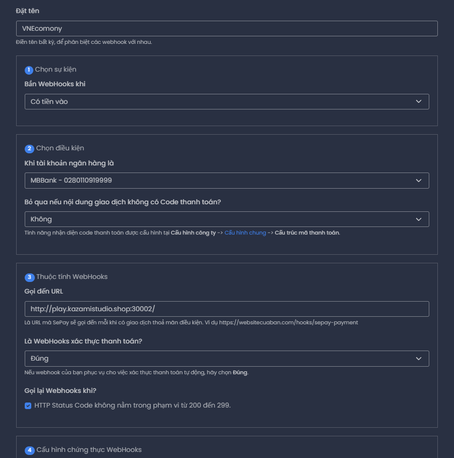
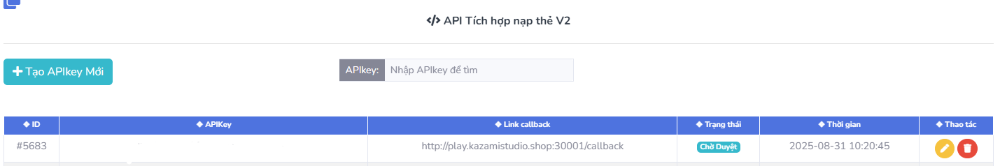

# VNEconomy (VND) — No Vault

Plugin kinh tế riêng không sử dụng Vault, cung cấp API để các plugin tùy biến hook vào.
---
- Đơn vị tiền tệ: Việt Nam (₫), định dạng ngắn 1.2M ₫ (có thể tắt).
- Lưu dữ liệu: YAML / SQLite / MySQL (HikariCP).
- PlaceholderAPI: `%vneco_balance%`, `%vneco_balance_formatted%`, `%vneco_top_1_name%`, `%vneco_top_1_amount%` (đến top_10).
- Top player, thông báo + âm thanh tuỳ chỉnh.
- Lệnh: 
- - `/vnmoney [player]`
- - `/vnmoney top`
- - `/vnmoney pay <player> <số tiền>`
- - `/vneco give|set|take <player> <số tiền>`
- - `/vneco reload`
- - `/napqr <số tiền>`
---

## Build
```bash
mvn -q -e -DskipTests package
```
---

## Cách sử dụng chức năng quét Qr
- Đầu tiên bạn truy cập vào website: https://sepay.vn
- Sau đó đăng ký tài khoản và làm theo các bước để thiết lập liên kết tài khoàn ngân hàng trên web
- Tiếp theo:
- - Sử dụng Tên ngân hàng và số tài khoàn bạn đã đăng ký liên kết trên SeaPay và gán vào config
- - Tại phần Webhook trên web gắn link vd: **http://ip_của_bạn:Port** server để web gửi dữ liệu Callback về nếu không đúng sẽ không nhận được nhưng tiền vẫn sẽ bj trừ (Nên lưu ý)
``` yaml
sepay:
  bank: "MBBank" # Ngân hàng mà bạn đăng ký trên sea-pay|MBBank, Viettin v.v
  account: "0280110919999" # Stk ngân hàng của bạn đã đăng ký theo đúng tk liên kết
```

---

## Cách sử dụng chức năng nạp thẻ
- Đầu tiên bạn cần tạo tài khoản trên web thesieutoc
- Vào phần Tích hợp API ấn vào API Website
- Tại đó bạn thấy phần Tạo APIkey mới thì tạo APIkey
- Trên server sau khi start server, copy ip kèm port host được thông báo và gán lên web thesieutoc (Lưu ý là port không được trùng với bất kỳ port nào đang sử dụng)
- Chờ khi PIkey được duyệt sẽ copy APIkey đó và bỏ vào config phần API-key


---

## API sử dụng trong plugin khác
```java
import org.fox.vneconomy.api.EconomyAPI;

double bal = EconomyAPI.get().getBalance(playerUUID);
EconomyAPI.get().give(playerUUID, 100000); // +100,000 ₫
EconomyAPI.get().take(playerUUID, 50000);  // -50,000 ₫
EconomyAPI.get().set(playerUUID, 1234567); // =1,234,567 ₫
boolean ok = EconomyAPI.get().has(playerUUID, 10000); // checkMoney
```
---
## Placeholder
- `%vneco_balance%` — số dư thô
- `%vneco_balance_formatted%` — số dư định dạng VND
- `%vneco_top_1_name%`, `%vneco_top_1_amount%` … đến 10

## Quyền
- `vneco.use` — dùng /money
- `vneco.pay` — dùng /money pay
- `vneco.admin` — dùng /eco

---

## 1. Plugin của bạn sẽ hook API như sau

Trong plugin khác, chỉ cần import class EconomyAPI từ VNEconomy.
Ví dụ:

```yaml
import org.fox.vneconomy.api.EconomyAPI;
import java.util.UUID;

public class MyPlugin {
public void testEco(UUID uuid) {
// Lấy số dư
double bal = EconomyAPI.get().getBalance(uuid);
System.out.println("Số dư: " + bal);

        // Cộng tiền
        EconomyAPI.get().give(uuid, 50000);

        // Trừ tiền
        EconomyAPI.get().take(uuid, 20000);

        // Set thẳng số dư
        EconomyAPI.get().set(uuid, 1000000);

        // Kiểm tra có đủ tiền không
        if (EconomyAPI.get().has(uuid, 10000)) {
            System.out.println("Người chơi có đủ tiền!");
        }
    }
}
```
---
## 2. Làm sao để tải API của VNEconomy trong plugin khác?

Có 2 cách:

### 🟢 Cách 1: Dùng plugin VNEconomy trực tiếp

Vì mình đã làm API bên trong plugin VNEconomy.jar, bạn không cần tải gì thêm.

Chỉ cần:

Thả `VNEconomy.jar` vào plugins/

Trong plugin.yml của plugin bạn, thêm:

`depend: [VNEconomy]`


hoặc nếu không bắt buộc thì:

`softdepend: [VNEconomy]`


Trong code, `import class từ org.fox.vneconomy.api.`

👉 Cách này dễ nhất vì bạn không phải build thêm file API riêng.
---
### 🟡 Cách 2: Dùng API Thư viện

Nếu bạn muốn build plugin mà không phụ thuộc JAR runtime, bạn có thể copy file VNEconomy-API.jar

Khi build plugin custom bằng Maven thêm đầy đủ api vào để tải thư viện api của plugin:

```yaml

<repository>
    <id>jitpack.io</id>
    <url>https://jitpack.io</url>
</repository>

<dependency>
    <groupId>com.github.ShadowZa982</groupId>
    <artifactId>VNEconomy</artifactId>
    <version>master-SNAPSHOT</version>
    <scope>provided</scope>
</dependency>

```